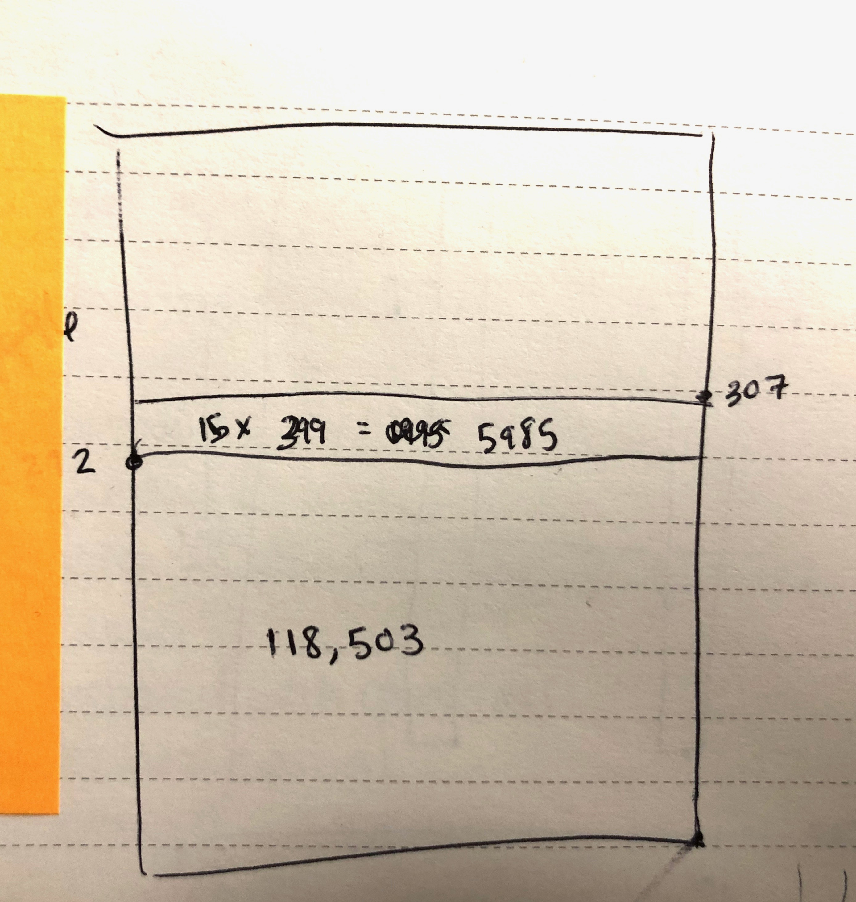
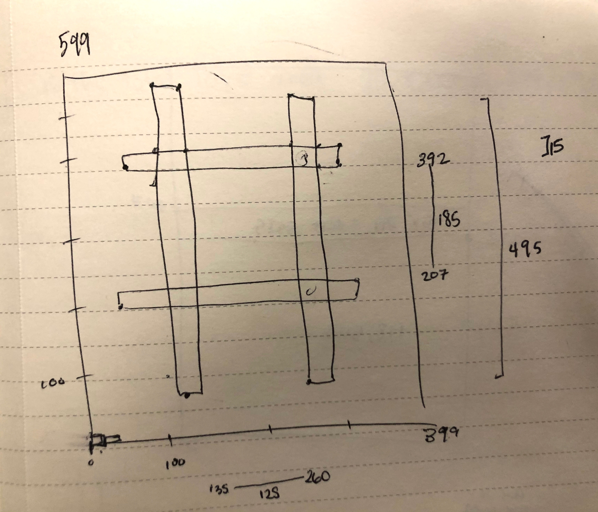

#Barren Land Analysis
I chose the Barren Land Analysis problem because the mathematical challenge intrigued me. I have demonstrated my technical ability in writing RESTful APIs on my GitHub account, (REFERENCE THEM HERE) however, I have limited experience in writing algorithms. I felt that tackling an unfamiliar intellectual challenge would offer more insight into my problem solving process. I learned a lot while working on this case study. 

I wrote the problem in JavaScript because I am most comfortable in the language. I also chose to write it in Node.js, which allows me to write server-side JavaScript. Although I could have written JavaScript to log in a browser console, or render on a DOM, I felt that those were skills in which I have a broad portfolio to demonstrate (REFERENCE). Node.js gave me a simple structure to receive quick feedback while I worked through the mathematical problem. 

Being someone who is very visual (although not great at drawing…), I sketched out the examples to help me understand the problem: 
     

From here I could lay the groundwork of how I would structure my data. I generated a 2 dimensional array, where each item was a JavaScript object containing values for “x” (int), “y” (int), “fertile”(boolean), and “checked”(integer where 0  = not yet checked, 1 = belongs to the first area, 2 = belongs to the second area, etc.). 

Once I built out the matrix, I faced the problem of distinguishing between independent plots of fertile land. Initially, I focused on solving the problem with recursion. This worked well on a small scale, but quickly maxed out my call stack when attempting to scale (up to ~90x90 grid). I asked a mentor for advice, and she told me to research tail-call optimization, where the calling function returns the value of the called function. After researching this, I found that it’s not supported in the framework I am working in (https://kangax.github.io/compat-table/es6/).

Finally, I remembered a time in class where we rewrote recursive functions using a “while” loop. Through my earlier research, I had learned that this problem is called “Flood Fill” and is commonly used in paint applications to color an enclosed area. So I Googled “flood fill algorithm without recursion” and came to a lovely StackOverflow discussion about this exact issue. Here I learned that I had been doing a Depth First Search when I could be doing a non-recursive Breadth First Search. I rewrote the function to check each point one at a time, storing its neighbors in a list for future checking. This system works much better in this framework. It maxes out at a field somewhere around 4000x4000 m.
(https://stackoverflow.com/questions/21865922/non-recursive-implementation-of-flood-fill-algorithm